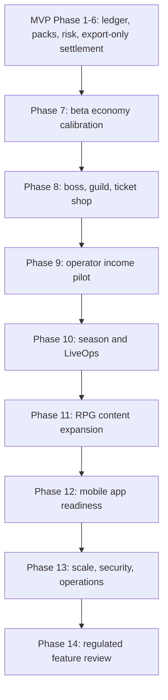

# 07 Post-MVP Roadmap

## Purpose

This roadmap defines phases after MVP and prevents unsafe cross-stage development. Later gameplay, mobile, scale, and regulated features must not bypass the evidence gates from MVP.

## Phase Dependency Graph



## No Cross-Stage Rule

- A phase can start design work early, but implementation must not merge until the previous phase exit gate is satisfied.
- Any feature touching withdrawal, payout, tax, payment, or external marketplace must wait for Phase 14 review unless it is explicitly export-only.
- Boss, guild, ticket, and RPG systems must not create a hidden cash-out path.
- Mobile or app-store packaging must not change the product boundary or wording.

## Phase Gates

| Phase | Entry Gate | Exit Gate | Rollback Gate |
|---|---|---|---|
| 7 Beta calibration | MVP release gates passed, deterministic dataset ready | economy metrics stable for review window | ledger mismatch, risk false positive, support spike |
| 8 Boss/guild/ticket | Phase 7 metrics approved | boss/ticket ledger and abuse tests pass | guild abuse or ticket liability mismatch |
| 9 Operator income pilot | Phase 8 risk controls stable | export-only settlement approved by finance/risk | disputed income, tax/profile failure, abuse cluster |
| 10 Season/LiveOps | settlement lock and leaderboard rules approved | scheduled campaign runs and rolls back cleanly | ranking corruption, unsafe copy, config leak |
| 11 RPG expansion | economy impact simulation approved | content flags and rollback validated | RPG rewards affect settlement or asset imbalance |
| 12 Mobile readiness | responsive web QA passes | PWA/store review package ready | mobile disclosure hides CTA or risk notice |
| 13 Scale/security | production-like load profile defined | SLO/load/security gates pass | p95, queue, webhook, or auth risk breach |
| 14 Regulated review | complete feature proposal and evidence | legal/accounting/payment decision recorded | no-go decision or unresolved written opinion |

## Redline Examples

The following changes require immediate review and cannot be shipped as normal content:

- Renaming player reward to income, profit, dividend, cash, yield, or withdrawal.
- Campaign copy implying "play to earn cash".
- Ticket shop product that can be exchanged for cash-equivalent value.
- Boss or guild reward promoted as a money-making route.
- Operator income calculated from self-trading or player gameplay profit.
- Third-party partner offering cash redemption for game assets.
- App-store screenshots hiding random item disclosure or withdrawal limitations.

## Cross-Phase Acceptance Standards

Each phase must provide:

- database migration plan if schema changes.
- API contract and error cases.
- ledger impact and reconciliation rule.
- risk controls and regression cases.
- frontend/mobile acceptance matrix if user-facing.
- admin permissions and audit log if backend tools change.
- rollback plan and data cleanup plan.
- product copy review for non-withdrawable wording.

## Required Evidence Folder

Each phase should store evidence under:

```text
docs/evidence/phase-{number}/
```

Minimum evidence:

- test run output.
- config version diff.
- QA checklist.
- risk review note.
- finance/accounting note when settlement is affected.
- screenshots for user-facing flows.

## Roadmap Completion Definition

The roadmap is complete when every phase file from `08` to `15` has:

- entry, exit, and rollback gates.
- measurable metrics.
- data/API contract or state model.
- QA tests.
- compliance/risk notes.
