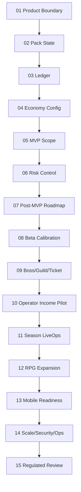

# 勇者傳說 Brave Legend Planning Index

## Purpose

This folder contains the 15 planning files required before implementation. The documents are written as development contracts: every phase must define boundaries, data rules, state models, review gates, and QA checks before coding begins.

## Document Status

| # | File | Development Status | Legal/Finance Review | QA Basis |
|---:|---|---|---|---|
| 01 | `01-product-boundary.md` | ready for backend/product implementation | required before payout | withdrawal boundary tests |
| 02 | `02-pack-state-machine.md` | ready for backend implementation | not required unless rules change | state/race tests |
| 03 | `03-ledger-invariants.md` | ready for backend implementation | finance review required | ledger replay tests |
| 04 | `04-economy-config.md` | ready for backend/admin implementation | finance/risk review required | config snapshot tests |
| 05 | `05-mvp-scope.md` | ready for MVP planning | finance review for Phase 6 | release gate checklist |
| 06 | `06-risk-control.md` | ready for risk tooling | privacy/legal review required | risk regression dataset |
| 07 | `07-post-mvp-roadmap.md` | ready for roadmap control | required for regulated phase | phase gate checklist |
| 08 | `08-phase7-beta-economy-calibration.md` | ready for beta planning | no payout approval | metric validation |
| 09 | `09-phase8-boss-guild-ticket-shop.md` | ready for gameplay backend planning | review if redemption changes value | boss/ticket tests |
| 10 | `10-phase9-operator-income-pilot.md` | ready for export-only pilot | tax/finance required | settlement replay tests |
| 11 | `11-phase10-season-liveops.md` | ready for admin/liveops planning | review if rewards change | rollback/audit tests |
| 12 | `12-phase11-rpg-content-expansion.md` | ready for content planning | not required unless value changes | content flag tests |
| 13 | `13-phase12-mobile-app-readiness.md` | ready for mobile QA planning | app-store/payment review | viewport matrix |
| 14 | `14-phase13-scale-security-operations.md` | ready for operations planning | security/privacy review | load/security tests |
| 15 | `15-phase14-regulated-feature-review.md` | ready as review gate | mandatory | no-go/go test plan |

## Required Reading Order

1. Product boundary and non-withdrawable assets.
2. Pack state machine.
3. Ledger invariants.
4. Economy config.
5. MVP scope.
6. Risk control.
7. Post-MVP roadmap.
8. Phase 7 through Phase 14 phase files.

## Phase Dependency



## No Cross-Stage Development Rule

- Later features may be discussed early but must not be implemented before previous phase exit gates pass.
- Anything involving payout, withdrawal, tax, cash-equivalent redemption, external payment, or third-party redemption must pass `15-phase14-regulated-feature-review.md`.
- Gameplay assets remain non-withdrawable unless a later written review explicitly changes that decision.
- If a test fails, the phase stops until the document or implementation is corrected.

## Verification

Run:

```powershell
node scripts\validate-planning-docs.mjs
```

The script checks that all 15 files exist and contain the required development anchors for boundary, state machine, ledger, config, MVP, risk, roadmap, beta, gameplay, operator income, LiveOps, RPG, mobile, scale/security, and regulated review.
